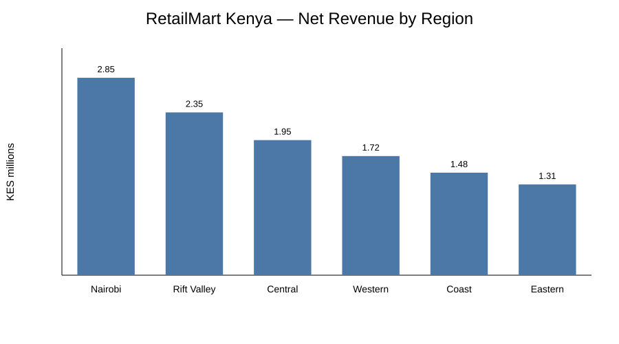
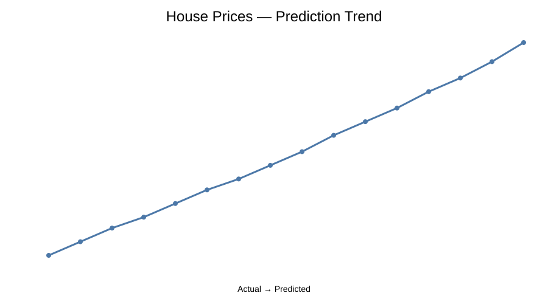
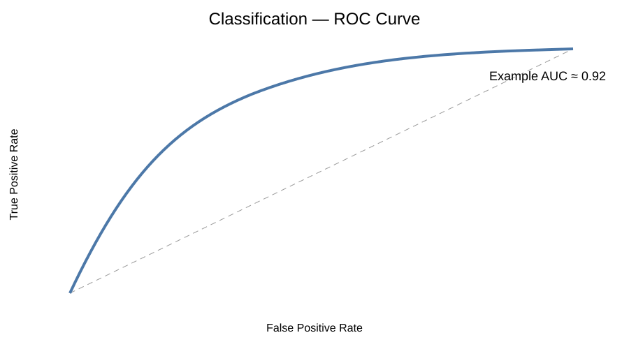
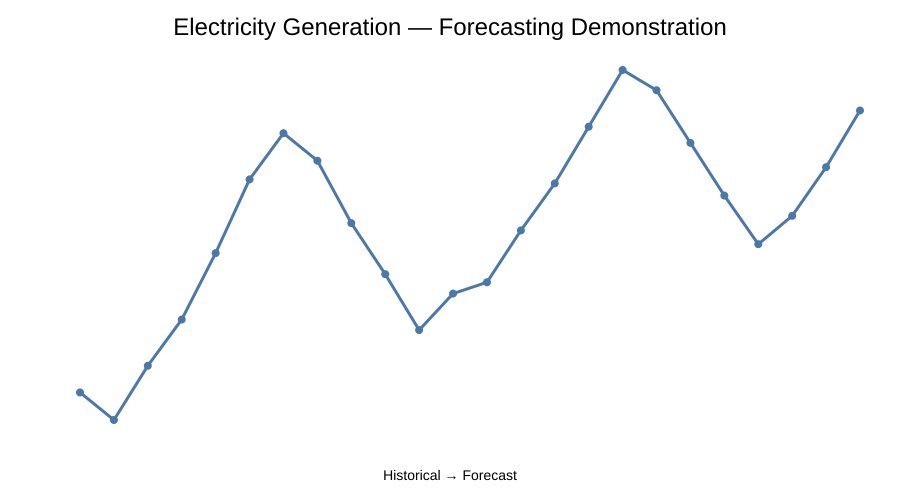
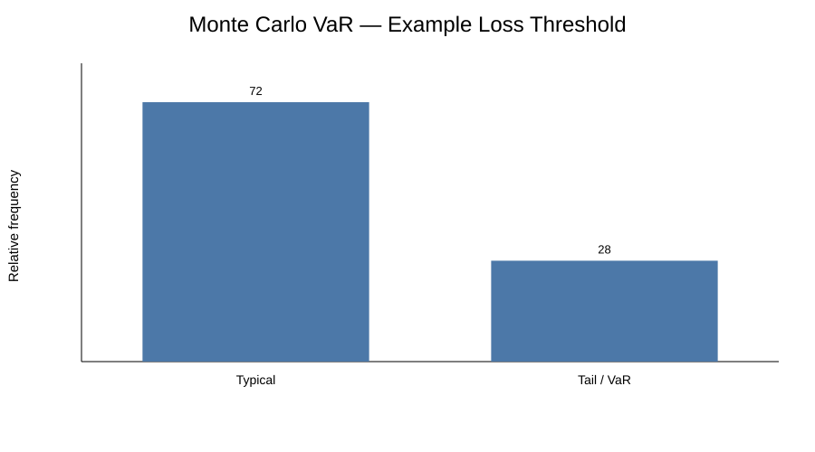
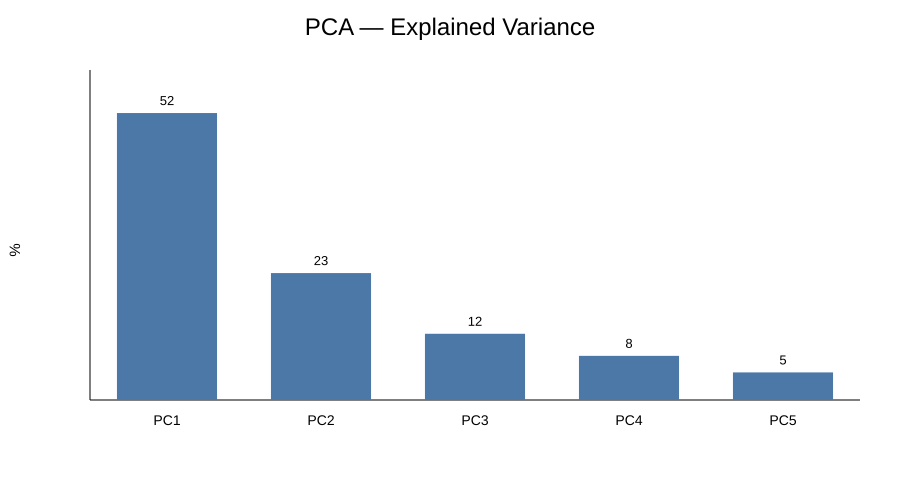
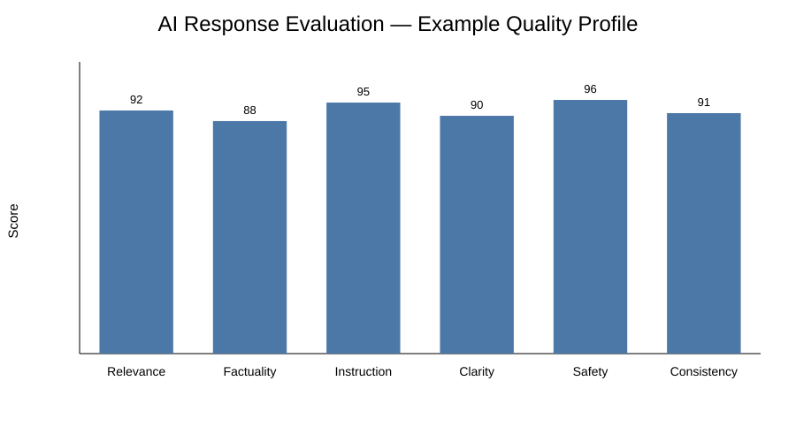

# Felista Mueni — Data, AI & Research Portfolio

### Data Analyst | Data Scientist | AI Services Specialist | Researcher | Academic & Technical Writer

I combine **data analytics, machine learning, AI evaluation, quantitative methods and research** to turn complex information into actionable, decision-ready results.

📍 Nairobi, Kenya  
💼 Available for remote freelance, consulting, analytics, AI evaluation, research and technical-writing projects.

## 🛠️ Core Skills

**Data & Analytics:** Data Analysis, EDA, Statistics, Data Cleaning, Feature Engineering, KPI Analysis, Data Storytelling

**Programming:** Python, SQL, R, STATA, SAS, Excel, Google Sheets

**BI & Visualization:** Power BI, Tableau, Looker, Looker Studio, Matplotlib, Seaborn, Plotly

**ML & AI:** Machine Learning, Predictive Modelling, Classification, Regression, Forecasting, Model Evaluation, AI Evaluation, Prompt Engineering, Data Annotation, NLP

**Research:** Systematic Literature Review, Rayyan, CASP, PRISMA, Critical Appraisal, Evidence Synthesis, Academic Editing, Technical Writing

**Quantitative Finance:** Financial Econometrics, Monte Carlo, VaR, CVaR, CAPM, PCA, Cointegration, Stochastic Modelling, Heston Model

## 📊 Featured Work

### ABB Digital IMEA Growth Analytics
**Business Intelligence | Forecasting | Power BI | Machine Learning**

A professional/project case study supporting an IMEA growth initiative targeting approximately **USD 47M to USD 100M by 2026**. Work included historical orders, pipeline analysis, country clustering, forecasting experiments and Power BI dashboard design.

> Confidential client data is not included.

### RetailMart Kenya Analytics
**Retail Analytics | BI | Visualization**

An end-to-end retail analytics case study covering revenue, profitability, regional performance, product performance, customer segments and dashboard preparation.



[View project](projects/02_retailmart/README.md) · [Notebook](notebooks/01_retailmart_eda_dashboard.ipynb)

### House Prices Predictive Modelling
**Machine Learning | XGBoost | Predictive Analytics**

Complete predictive workflow using train/test validation, XGBoost, RMSE and R².



[Notebook](notebooks/02_house_prices_xgboost.ipynb)

### NMES Classification & ROC-AUC
**Classification | Statistical Learning | Model Evaluation**

Classification pipeline demonstrating preprocessing, scaling, logistic regression, ROC analysis and ROC-AUC.



> A previous NMES modelling exercise achieved approximately **0.769 ROC-AUC**. The notebook in this repository uses synthetic data and is a separate demonstration.

[Notebook](notebooks/03_nmes_classification_roc_auc.ipynb)

### Electricity Generation Forecasting
**Time Series | ARIMA | Forecasting**

Practical forecasting workflow covering time-series preparation, train/test splitting, ARIMA, forecast generation, MAE and visualization.



[Notebook](notebooks/04_electricity_arima_forecasting.ipynb)

### Quantitative Finance & Risk Analytics
**Financial Engineering | Econometrics | Risk Modelling**

Work covering Heston modelling, PCA, Johansen cointegration, fractional differencing, Kalman filtering, ARCH processes, VaR/CVaR, CAPM and Monte Carlo.





[Risk notebook](notebooks/05_financial_risk_var_cvar_monte_carlo.ipynb) · [PCA notebook](notebooks/06_financial_pca.ipynb)

## 🤖 AI Services

### AI Model Evaluation
I use structured rubrics to evaluate AI outputs for **relevance, factuality, instruction following, clarity, consistency and quality**.



[Evaluation notebook](notebooks/08_ai_model_evaluation.ipynb)

## 🔬 Research Portfolio

### Systematic Literature Review — Rayyan
Research-support workflow covering search-result management, duplicate removal, title/abstract screening, eligibility decisions, labels/filters, full-text screening and PRISMA-oriented documentation for microbiology laboratory pre-analytical errors.

[View case study](projects/05_systematic_review/README.md)

### CASP Critical Appraisal — COVID-19 Case-Control Study
Structured critical appraisal covering study design, participant selection, exposure measurement, confounding, validity, results and applicability.

[View case study](projects/06_casp/README.md)

### Research Paper Library Organization
Client project involving organization, categorization, standardized naming and summarization of an approximately 40-paper research library.

## 🔎 Evidence Map

### Professional & Business Analytics
- [ABB Digital IMEA Growth Analytics](projects/01_abb_digital_imea/README.md)
- [RetailMart Kenya Analytics](projects/02_retailmart/README.md)
- [Power BI Dashboard Evidence](projects/12_power_bi_dashboard/README.md)
- [Tableau Dashboard Evidence](projects/13_tableau_dashboard/README.md)
- [SQL Business Analytics](projects/10_sql_analytics/README.md)

### AI & Data Quality
- [AI Model Evaluation](projects/09_ai_evaluation/README.md)
- [Data Annotation Quality](notebooks/24_data_annotation_quality.ipynb)
- [NLP Text Classification](notebooks/23_nlp_text_classification.ipynb)

### Research & Writing
- [Systematic Review Evidence Workflow](projects/11_research_workflow/README.md)
- [CASP Critical Appraisal](projects/14_casp_critical_appraisal/README.md)
- [Academic & Technical Editing](projects/15_academic_editing/README.md)
- [Research Paper Library Organization](projects/17_research_paper_library/README.md)

### Teaching & Mentoring
- [Data Science Teaching & Technical Mentoring](projects/16_teaching_mentoring/README.md)

### Technical Evidence
The notebooks directory contains reproducible demonstrations spanning machine learning, forecasting, SQL, NLP, AI evaluation, quantitative finance, clustering, model explainability and statistical modelling.

## 🧑‍🏫 Teaching & Mentoring

I also mentor and teach practical data science across **Python, SQL, Excel, Power BI, Tableau, statistics, visualization and machine learning**, with a project-based approach.

## 📁 Repository Structure

```
notebooks/       Reproducible Python/SQL demonstrations
data/            Synthetic datasets for reproducibility
projects/        Case studies and professional project summaries
assets/          Portfolio charts and visual evidence
EVIDENCE_MATRIX.md
GITHUB_SETUP.md
```

## 🔐 Data & Ethics

Professional/client projects are represented with **sanitized descriptions only**. Confidential client datasets, private research records and proprietary documents are not published.

Synthetic data is explicitly identified as synthetic.

## 📫 Work With Me

**Data Analysis • Data Science • Power BI • Tableau • SQL • Python • Machine Learning • AI Evaluation • Prompt Engineering • Research • Systematic Literature Reviews • Critical Appraisal • Technical Writing • Academic Editing**

> **Turning data, AI and research into clear, reliable, decision-ready results.**
