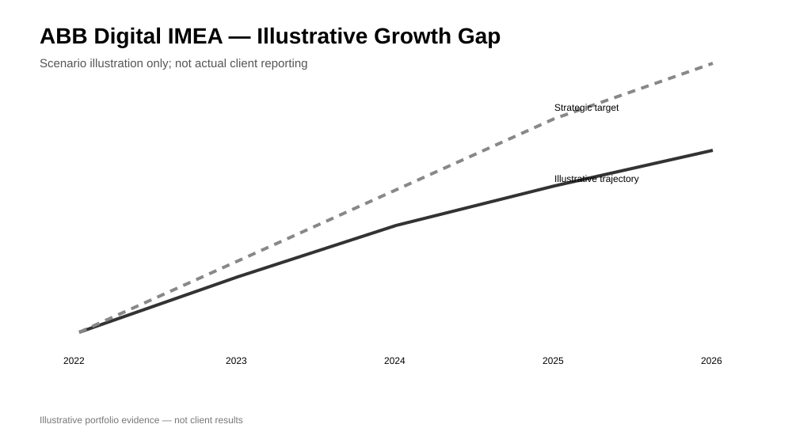
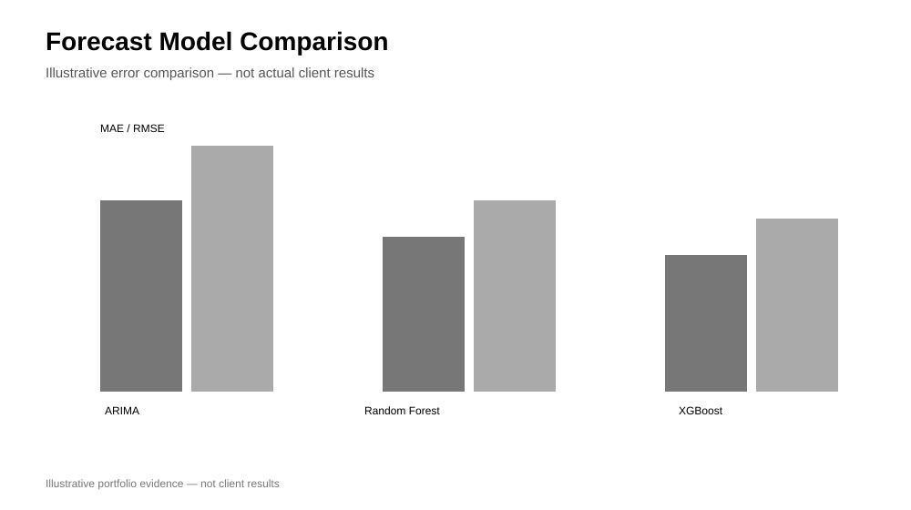

# ABB Digital IMEA Growth Analytics

**Professional/project work — sanitized case study.**

## Business context
Analysed an IMEA growth initiative targeting growth from approximately **USD 47M to USD 100M by 2026**.

## Analytical workflow
Historical orders → pipeline analysis → country clustering → ARIMA/XGBoost/Random Forest forecasting experiments → scenario analysis → Power BI dashboard design.

## Demonstrates
Business analytics, forecasting, segmentation, scenario analysis, KPI design and executive reporting.

## Outcome orientation
The analysis was designed to compare historical performance and pipeline coverage with the strategic target and identify the remaining growth gap.

## Visual evidence
The following are **illustrative portfolio visuals**, not actual ABB client reporting:

> Confidential client data, proprietary dashboards and internal records are not published.
